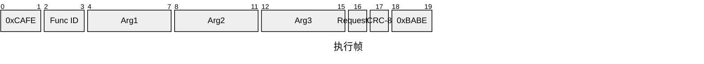
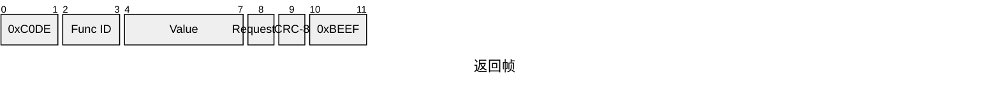
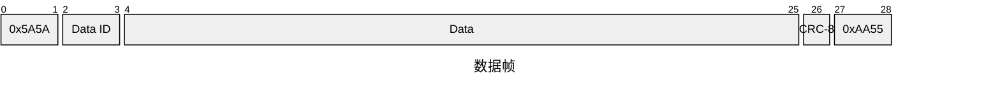
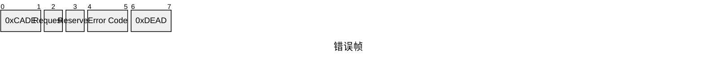

## ARES2025上下位机通信
### 一、执行
#### 1. 发送帧

#### 2. 接收帧

### 二、数据
#### 1. 同步帧

⚠️注意：Data为可拓展，但最后整个帧长度不得超过2000bit
### 三、错误
#### 1. 心跳包

#### 2. 错误码
```c
#define UNMATCH_CRCx BIT(0)
 #define UNKNOWN_HEAD BIT(1)
 #define UNKNOWN_TAIL BIT(2)
 #define UNKNOWN_FUNC BIT(3)
 #define UNKNOWN_SYNC BIT(4)
 #define TOOHIGH_FREQ BIT(5)
 #define CLEANED_PACK BIT(6)
```
错误帧中的Request ID可以是执行帧的Request ID，也可以是数据帧的Data ID。
上位机最好保存尽可能多的数据，下位机会至少保留256Bytes
CRC不包括head和tail。所有CRC均使用标准CCITT（no reflection of input or output. ）
CRC8 Initial Value: 0x00